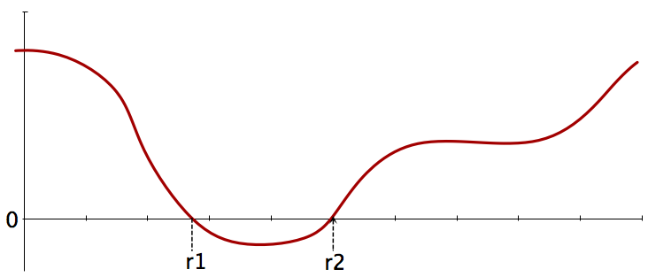
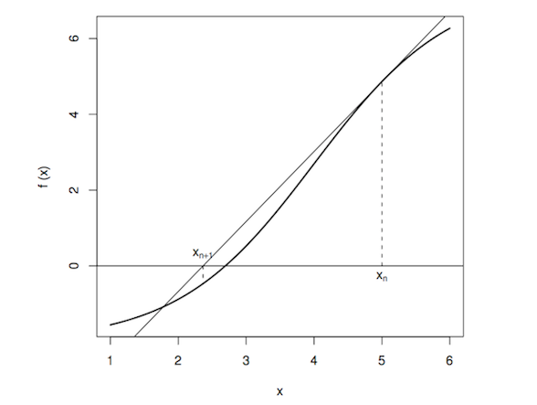

Control Structures
==================

---

Control Structures
==================

* **Conditions**: Use `if` or `switch` statements to control execution conditional on data.
* **Iteration**: Use `for()`, `while()` and `repeat()` to do similar things a certain number of times, or while conditions hold, or until conditions are met.
* **Vectorizing**: Explicit iteration is often unclear, slow, and needlessly detailed; avoid it by working with vectors of values.

---

Conditional Statements
======================

Conditionals specify which calculation to execute, based on conditions:

###Examples:###

$$|x| = \left\\{  \begin{array}{rl} x & \text{if } x \ge 0 \cr 
-x & \text{if } x < 0 \end{array} \right.$$

$$\phi(x) = \left\\{  \begin{array}{rl} x^2 & \text{if } |x| \le 1 \cr 
2|x|-1 & \text{if } |x| > 0 \end{array} \right.$$

assign: 

- group="child" if age<13 
- group="adolescent" if age<18 
- group="adult" otherwise

---

`if` statement
==============

    !r
    if (x >= 0) { 
        x
    } else { 
        -x
    }

The condition in if needs to give one TRUE or FALSE value else clause is optional

*What if x is a numeric vector?*

---

What is TRUE?
=============

Any valid *numerical* value except 0 counts as TRUE (0 is FALSE).

Most non-numerical values raise exceptions:

    !r
    > if(1) {"Truth!"} else {"Falsehood!"}
    [1] "Truth!"
    > if(-1) {"Truth!"} else {"Falsehood!"}
    [1] "Truth!"
    > if(0) {"Truth!"} else {"Falsehood!"}
    [1] "Falsehood!"
    > if("TRUE") {"Truth!"} else {"Falsehood!"}
    [1] "Truth!"
    > if("TRUTH") {"Truth!"} else {"Falsehood!"}
    Error in if ("TRUTH") { : argument is not interpretable as logical
    > if("c") {"Truth!"} else {"Falsehood!"}
    Error in if ("c") { : argument is not interpretable as logical
    > if(NULL) {"Truth!"} else {"Falsehood!"}
    Error in if (NULL) { : argument is of length zero
    > if(NA) {"Truth!"} else {"Falsehood!"}
    Error in if (NA) { : missing value where TRUE/FALSE needed
    > if(NaN) {"Truth!"} else {"Falsehood!"}
    Error in if (NaN) { : argument is not interpretable as logical

---

`else if`
=========

When there are more than two conditions, they can be specified using `else if`:

    !r
    if (age<2) {
        group <- 'infant'
    } else if (age<12) {
        group <- 'child'
    } else if (age<18) {
        group <- 'adolescent'
    } else {
        group <- 'adult'
    }

---

Nested `if` statements
======================

Conditionals can nest arbitrarily deeply:
    
    !r
    if (x^2 < 1) {
        x^2
    } else {
        if (x >= 0) {
            x
        } else {
            -x 
        }
    }

---

`switch` statement
==================

There can be an arbitrary number of alternatives for an `if` statement, but the syntax becomes awkward for a large number of conditions.

`switch` is more efficient for a large number of possible outcomes:

    !r
    centre <- function(x, type) {
       switch(type,
              mean = mean(x),
              median = median(x),
              trimmed = mean(x, trim = .1))
     }
     x <- rnorm(10)
     centre(x, "mean")
     centre(x, "median")
     centre(x, "trimmed")

---

`for` loops
===========

Often, a programming task requires that we iterate over a set of values, applying the same (or similar) action several times in a row. If the number of calculations is known *a priori*, we can apply a `for` loop:

    !r
    > x <- c(5,12,13)
    > for (n in x) print(n^2)
    [1] 25
    [1] 144
    [1] 169

Because `x` is a vector, it is *iterable*. Starting at the first element, `n` takes on the next value in `x` at every iteration, ending when there are no more elements available. Another example, using indices:

    !r
    > n <- 10
    > logs <- vector(length=n)
    > for (i in 1:n) {
    +   logs[i] <- log(i)
    + }
    > logs
     [1] 0.0000000 0.6931472 1.0986123 1.3862944 1.6094379 
     [6] 1.7917595 1.9459101 2.0794415 2.1972246 2.3025851

---

Combining Control Structures
============================

Control structures can be combined. For example, when a decision is made at every iteration of a loop, depending on the current value:

    !r
    x <- c(-5,7,-8,0)
    y <- vector(length=length(x))
    for (i in 1:length(x)) {
        if (x[i] >= 0) {
            y[i] <- x[i]
        } else {
            y[i] <- -x[i]
        } 
    }

---

Conditional Iteration: `while`
==============================

In some cases, we do not know how many iterations will be required in order to achieve a result. The `while` statement executes until its argument evaluates to `FALSE`:

    !r
    > i <- 0
    > while(i<2) i <- i + rnorm(1)
    > i
    [1] 2.015834
    
Loop is executed forever if the condition is always `TRUE`!

All loops can be broken:

    !r
    > i <- 0
    > while(TRUE) {
    +   i <- i+1
    +   if (i>10) break
    + }

---

Exercise
========

Change the following `for` loop into a `while` loop:

    !r 
    x <- 0
    for (i in 1:10) {
        x <- x + log(x)
    }

---

Unconditional Iteration: `repeat`
=================================

`repeat` iterates endlessly, unless broken:

    !r
    repeat {
        print("I am trapped in an endless loop!!")
    }

More useful implementation:

    !r
    repeat {
        if (watched) {
            next()
        }
        print("I am trapped in an endless loop!!")
        if (rescued) {
            break()
        }
    }
    
The `next` function skips the rest of the body and goes back into the loop.

---

Programming with Control Structures:
====================================

### Root-finding

As a motivating example for implementing loops and `if` statements, we will consider a common computational task in computational statistics: ***root-finding***.

Consider a function $f:\mathbf{R} \Rightarrow \mathbf{R}$. The *root* is a solution to $f(x)=0$.

---

Fixed-point Iteration
=====================

One method for finding roots computationally is *fixed-point iteration*. For some function $g:\mathbf{R} \Rightarrow \mathbf{R}$, a fixed point is:

$$a \in \mathbf{R}: g(a) = a$$

So, if we define our function $f$ as:

$$f(x) = c(g(x)-x)$$

then we can find the root of $f$ when we find the fixed point of $g$. Conversely:

$$g(x) = cf(x) + x$$

---

Iterative Method
================

In order to find a fixed point, we will generate a sequence of "guesses" $x_0, x_1, x_2, \ldots$ that (hopefully) converges to $a: g(a)=a$.

The method begins with an initial guess $x_0$, from which we generate $x_1 = g(x_0)$, then $x_2 = g(x_1)$, etc.

In general, this is a 1st-order recurrence equation:

$$x_{n+1} = g(x_{n})$$

We can show that $x_n \rightarrow a$ is a fixed point of $g$.

$$a = \lim_{n \rightarrow \infty} x_{n+1} = \lim_{n \rightarrow \infty} g(x_n)$$ 
$$ = g(\lim_{n \rightarrow \infty} x_n) = a$$

therefore, $a$ is a fixed point of $g$.

---

Convergence
===========

Sadly for us, $\\{x_n\\}_{n=0}^{\infty}$ does not always converge.

### Example

$$g_1(x) = x^{1.5}, \, g_2(x) = x^{0.75}$$

both $g_1, g_2$ have fixed points at 1 (by inspection), but $g_1$ diverges.

In general, the algorithm converges if $|g'(a)<1|$, and diverges otherwise.

* Also, the initial value should be in the "neighborhood" of $x_0$ to guarantee convergence.

In practice, we may *converge* to $a$ without reaching it. We want to stop when $x_n$ is "close enough":

$$ |x_n - x_{n-1}| \le \epsilon$$

---

Example
=======

**Find the root of** $f(x) = \log(x) - \exp(-x)$

How do we define $g$?

1. Put one term on both sides of the equation, and exponentiate:

    $g_1: x = \exp(\exp(-x))$
    
2. Subtract $x$ from both sides:

    $g_2: x = x - \log(x) + \exp(-x)$
    
3. Add $x$ to both sides:

    $g_3: x = x + \log(x) - \exp(-x)$

---

Problems?
=========

1. There are many ways of expressing $g(x)$, each having different convergence properties.
2. The algorithm is relatively **slow**.
    * the error is divided by a constant factor at each iteration

---

Newton-Raphson
==============

Suppose $f$ is differentiable, with continuous $f'$ and root $a$. Starting with an initial guess $x_0$, we can draw a straight line through $(x_0, f(x_0))$ that has slope $f'(x_0)$:

$$f'(x_0) = \frac{f(x_0) - y}{x_0 - x}$$

---

Newton-Raphson
==============

The tangent line crosses the x-axis at some point $x_1$, which is (we hope) a better approximation to $a$.

$$f'(x_0) = \frac{f(x_0)-0}{x_0 - x_1}$$

$$\Rightarrow x_1 = x_0 - \frac{f(x_0)}{f'(x_0)}$$

Hence, our next guess $x_2$ becomes:

$$x_2 = x_1 - \frac{f(x_1)}{f'(x_1)}$$

Generally:

$$x_{n+1} = x_n - \frac{f(x_n)}{f'(x_n)}$$

---

Convergence of Newton-Raphson
=============================

The Newton-Raphson algorithm converges quickly if:

* $f'(a) \ne 0$
* $f"$ is finite and continuous at $a$
* algorithm is initialized suitably close to $a$

If $x_n \rightarrow a$:

$$\begin{aligned}a &= \lim_{n  \rightarrow \infty} x_{n+1} = \lim_{n  \rightarrow \infty} \left[
x_n - \frac{f(x_n)}{f'(x_n)}\right] \cr
&= \lim_{n  \rightarrow \infty} x_n - \frac{f(\lim x_n)}{f'(\lim x_n)} = a - \frac{f(a)}{f'(a)} \cr
&\Rightarrow f(a) = 0\end{aligned}$$

---

Convergence of Newton-Raphson
=============================

We stop when $f(x_n)$ is sufficiently close to zero:

$$|f(x_n)| \le \epsilon$$

If sequence is converging to $a$, then for $x$ near $a$, we have:

$$f(x) \approx f'(a)(x-a)$$

$$\Rightarrow |x-a| \le \frac{\epsilon}{f'(a)}$$

---

Vectorization
=============

Though iteration (looping) is a fundamental and useful programming tool, in R we often want to *avoid* iteration and perform operations on data structures as a whole.

For example, in some languages, vector addition proceeds analogous to:

    !r
    c <- vector(length(a))
    for (i in 1:length(a)) {
        c[i] <- a[i] + b[i]
    }

But in R, as we have seen, we can add the entire vector rather than operating element-wise:

    !r
    c <- a + b

---

Vectorization
=============

There are several advantages to vectorized operations:

* Clear: the syntax is about *what* we are doing.
* Abstract: the syntax hides the implementation.
* Concise: one line!
* Fast: looping in R is extremely slow. Vectorized functions take advantage of faster low-level code.

---

Vectorized Calculations
=======================

Many of R's built-in functions are already vectorized:

    !r
    abs(x)
    log(x)
    
Conditional statements can avoid embedding `if` statements in loops:

    !r
    ifelse(x<0, -x, x)
    ifelse(x^2>1, abs(x), x^2)
    
Generate sequences:

    !r
    > rep(1,10)
     [1] 1 1 1 1 1 1 1 1 1 1
    > seq(10,20,by=2)
    [1] 10 12 14 16 18 20

---

Arrays with Repeated Structure
==============================

We can generate combinations of values from vectors, using `expand.grid`:

    !r
    > expand.grid(intervention=c("control", "treatment"), gender=c("M","F"))
      intervention gender
    1      control      M
    2    treatment      M
    3      control      F
    4    treatment      F

Matrices can be generated from vectors with `outer`:

    !r
    > outer(c(1,3,5),c(2,3,7),‘*‘)
         [,1] [,2] [,3]
    [1,]    2    3    7
    [2,]    6    9   21
    [3,]   10   15   35
    
We can repeat the same action repeatedly using `replicate`:

    !r
    > mean(replicate(1000, sd(rnorm(1000))))
    [1] 0.9992584

<!-- Mathjax -->

